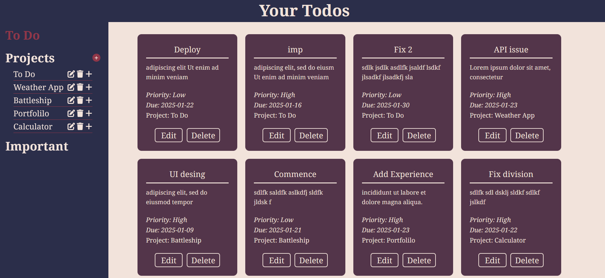
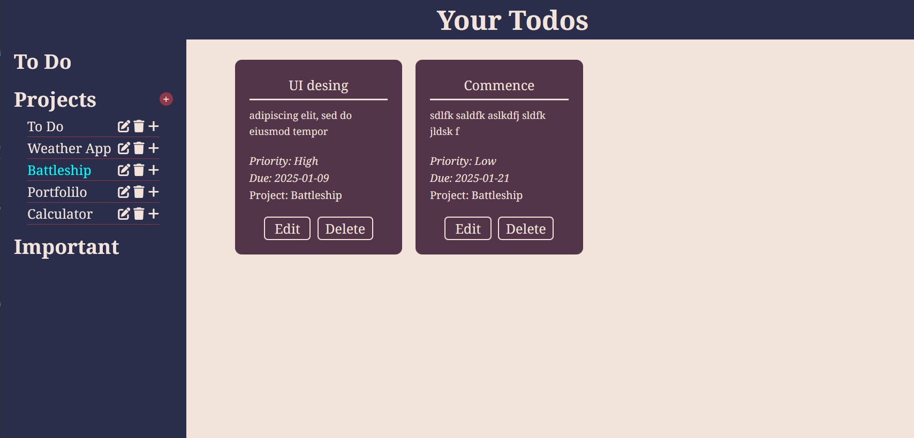

# Todo App

### [Live Demo](https://mainul-islam-nirob.github.io/todo-app/)

#### 📝 Description

This is a simple To-Do application built with HTML, CSS, and JavaScript. The app allows users to manage their tasks with options to create and view projects, add tasks, and prioritize them.

#### 💡 Features

- **Task Management**: Add tasks with a title, description, due date, and priority.
- **Project Management**: Create new projects to organize tasks.
- **Modal Interaction**: Add tasks and projects through modals that open when a user clicks on the "+" button.

## Future Enhancements

The following features are planned for future updates:

1. **Refactor Code**: Improve code readability and maintainability by organizing and optimizing JavaScript logic.
2. **Close Modal on Outside Click**: Implement a feature to close the modal when the user clicks outside the modal and background.
3. **View Tasks by Timeframe**: Add options to view tasks due today, this week, or this month.
4. **Dropdown Project Selection**: Allow users to select a project from a dropdown menu while adding tasks.
5. **Checklist Option**: Add an option to mark tasks as complete through a checklist.
6. **Archive Feature**:
   - Enable users to delete tasks, moving them to an "Archive" section.
   - Automatically delete archived tasks after 30 days.
   - Provide an option to restore deleted tasks from the archive before they are permanently removed.

#### 🛠️ Built with

- **HTML**: Used for structuring the webpage.
- **CSS**: Styling of the app for a clean, responsive interface.
- **JavaScript**: Adding interactivity, like opening and closing modals, and handling task/project input.

### How to Use the App

- **Create Projects**: Click the "+" button next to "Projects" in the sidebar to open the modal and create a new project.
- **Create Tasks**: Click on any project to open the task creation modal, where you can add a task with title, due date, description, and priority.
- **Modal Functionality**: Modals open when the "+" button is clicked. Click the close button to close the modal.

### Author
- **Md. Mainul Islam**